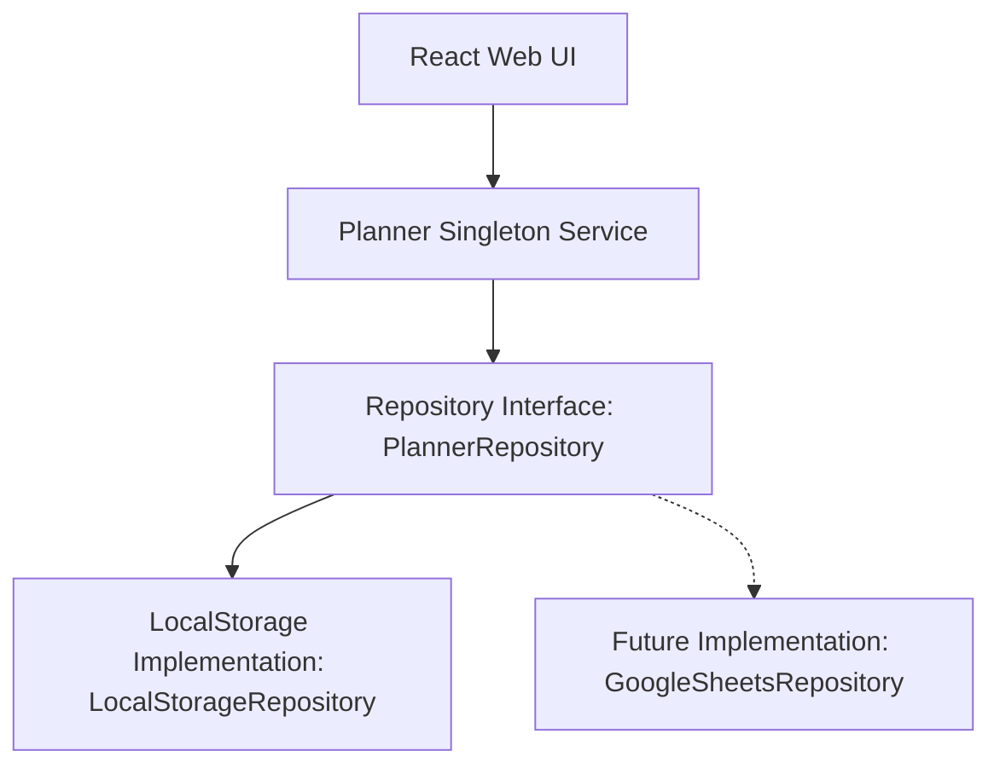

# System Architecture — Weekly Production Planner

This document provides a comprehensive overview of the architecture, layers, and boundaries of the Weekly Production Planner, frozen at Prototype v1.2 Baseline in preparation for production backend integration.

---

## 📐 1. Architectural Layers & Boundaries

The application is structured around clean design principles separating user interfaces, domain rules, and data access.



### Layer Breakdown
1. **Presentation Layer (React Web UI)**: Contain components organized by feature module under `src/features/`.
2. **Domain/Calculation Layer (`src/domain/`)**: Pure business logic (e.g., date calculations, delivery calendar allocation mappings, planned quantity balance rules).
3. **Repository Interface Layer (`src/services/repositories/PlannerRepository.ts`)**: Defines the data-access contract.
4. **Data Concrete Layer**:
   - **Prototype v1.2 Baseline**: `LocalStorageRepository` handles persisting all entities.
   - **Production Target (Future Phase)**: `GoogleSheetsRepository` (or Apps Script API Wrapper) will map repository operations to backend endpoints.

---

## 🔌 2. Repository Pattern Contracts

The `PlannerRepository` interface ensures decoupling of business/UI layers from data access mechanics.

```typescript
export interface PlannerRepository {
  initialize(): void;
  reset(): void;
  getSnapshot(): DatabaseSchema;
  importDatabase(data: DatabaseSchema): ImportDatabaseResult;

  // Customers
  listCustomers(includeInactive?: boolean): CustomerMaster[];
  createCustomer(input: Omit<CustomerMaster, 'customerId' | 'createdAt' | 'updatedAt'>): CreateCustomerResult;
  updateCustomer(id: string, input: Partial<Omit<CustomerMaster, 'customerId' | 'createdAt' | 'updatedAt'>>): UpdateCustomerResult;
  setCustomerActive(id: string, active: boolean): void;

  // Products
  listProducts(includeInactive?: boolean): ProductMaster[];
  listProductsByCustomer(customerId: string, includeInactive?: boolean): ProductMaster[];
  createProduct(input: Omit<ProductMaster, 'productId' | 'createdAt' | 'updatedAt'>): CreateProductResult;
  updateProduct(id: string, input: Partial<Omit<ProductMaster, 'productId' | 'createdAt' | 'updatedAt'>>): UpdateProductResult;
  setProductActive(id: string, active: boolean): void;

  // Orders & POs
  listSalesOrders(filters?: Partial<SalesOrderFilters>): SalesOrderSnapshot[];
  createSalesOrder(input: CreateSalesOrderInput): CreateSalesOrderResult;

  // Planning & Allocations
  listWeeklyPlans(): WeeklyPlan[];
  createDraftPlan(weekStartIso: string): CreateDraftPlanResult;
  publishPlan(planId: string): void;
  cancelDraftPlan(planId: string): void;
  createPlanRevision(planId: string): CreateDraftPlanResult;
  listPlanAllocations(planId: string): PlanAllocation[];
  savePlanAllocation(alloc: PlanAllocation): void;
  removePlanAllocation(allocId: string): void;

  // Actuals
  listProductionActuals(weekStartIso: string): ProductionActualEntry[];
  saveProductionActual(entry: ProductionActualEntry): void;

  // WIP Items
  listWipPrepItems(includeInactive?: boolean): WipPrepItem[];
  createWipPrepItem(input: Omit<WipPrepItem, 'wipPrepId' | 'itemCode' | 'createdAt' | 'updatedAt'>): CreateWipPrepItemResult;
  updateWipPrepItem(id: string, input: Partial<Omit<WipPrepItem, 'wipPrepId' | 'itemCode' | 'createdAt' | 'updatedAt'>>): UpdateWipPrepItemResult;
  setWipPrepItemActive(id: string, active: boolean): void;

  // Board Notes
  listBoardNotes(planId: string): BoardNote[];
  saveBoardNote(note: BoardNote): void;
  removeBoardNote(noteId: string): void;
}
```

---

## 🔒 3. Frontend & Backend Boundaries

In preparation for Google Sheets backend integration, all server interactions must go through RESTful API endpoints hosted via Google Apps Script. 

- **Frontend Responsibilities**: Input validation, reactive UI updates, client-side filtering, drag & drop visualization, and calculations.
- **Backend Responsibilities (Google Apps Script)**: Data storage, transaction locks, unique key validation, audit trail history, and generation of reports.
